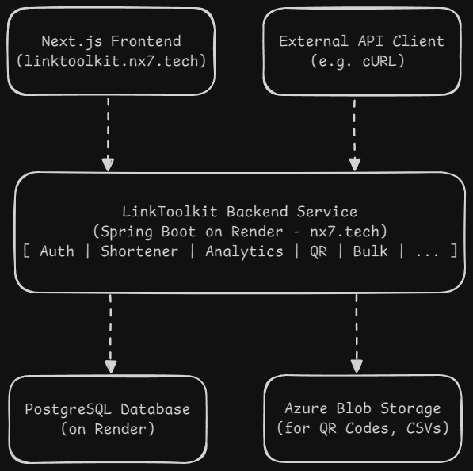

# LinkToolkit Backend

[](https://github.com/Sid-op777/linktoolkit-backend/actions)
[](https://opensource.org/licenses/MIT)

This repository contains the backend service for LinkToolkit, a modern and feature-rich URL shortening platform. The service is built with Spring Boot and provides a comprehensive REST API to support the [LinkToolkit frontend](https://linktoolkit.nx7.tech).

**Live Demo:**
*   **Frontend Application:** [linktoolkit.nx7.tech](https://linktoolkit.nx7.tech)

---

## Features

*   **URL Shortening:** Generate short, unique aliases for long URLs with optional custom aliases and configurable expiry dates.
*   **User Accounts:** Supports both anonymous and registered users. Anonymous links created within a session are automatically claimed upon registration.
*   **QR Code Generation:** Instantly generate and upload QR codes for any shortened link to Azure Blob Storage.
*   **Link Analytics:** Detailed analytics for each link, tracking total clicks, time-series data, referrers, devices, and geographic locations.
*   **Dual Authentication:** Secure access via both JWT for web sessions and persistent API Keys for developers.
*   **System Maintenance:** Includes an automated, scheduled job to clean up expired links from the database.

## Tech Stack & Architecture

This project is built with a modern, scalable, and containerized technology stack.

#### Core Technologies


#### Cloud & Deployment


#### Architecture

The system is designed with a clean separation of concerns, utilizing cloud services for scalability and resilience.




## API Documentation

The API is documented using the OpenAPI 3 standard.

*   **Public API Documentation (Redoc):** A clean, user-friendly view of the API is available at [**api.nx7.tech/docs**](https://api.nx7.tech/docs).
*   **Developer API Reference (Swagger UI):** While running locally, a Swagger UI instance is available for interactive API testing at `http://localhost:8080/swagger-ui.html`.

## Getting Started

Follow these instructions to get the project running on your local machine for development and testing using Docker.

### Prerequisites

*   **Docker & Docker Compose:** Ensure you have a recent version installed. Docker will handle the Java and Maven environment internally.
*   **Azure Account:** To obtain credentials for Azure Blob Storage.

### Local Development Setup

1.  **Clone the repository:**
    ```sh
    git clone https://github.com/Sid-op777/linktoolkit-backend.git
    cd linktoolkit-backend
    ```
2.  **Create the environment file:**
    Create a new file named `.env` in the root of the project. This file will hold all your secrets and local configuration. **This file should never be committed to Git.**

    Copy the following content into your `.env` file and replace the placeholder values with your actual secrets.
    ```dotenv
    # .env file for LOCAL DEVELOPMENT

    # Server and App URLs
    SERVER_PORT=8080
    APP_BASE_URL=http://localhost:8080
    APP_FRONTEND_URL=http://localhost:3000

    # Local Docker Database Credentials
    SPRING_DATASOURCE_URL=jdbc:postgresql://postgres:5432/linktoolkit
    SPRING_DATASOURCE_USERNAME=user
    SPRING_DATASOURCE_PASSWORD=password
    SPRING_DATASOURCE_DB_NAME=linktoolkit # Used by docker-compose

    # Secrets
    JWT_SECRET=your-super-secret-long-and-secure-base64-encoded-key-here
    AZURE_STORAGE_ACCOUNT_NAME=your_azure_storage_account_name
    AZURE_STORAGE_ACCOUNT_KEY=your_azure_storage_account_key
    AZURE_STORAGE_ENDPOINT=https://your_account_name.blob.core.windows.net/
    ```
3.  **Run the application:**
    Use Docker Compose to build the application image and start both the Spring Boot app and PostgreSQL database containers.
    ```sh
    docker-compose up --build
    ```
    The application will be available at `http://localhost:8080`. The API is now ready to be tested with tools like Postman or cURL.

## License

This project is licensed under the MIT License - see the [LICENSE](LICENSE) file for details.